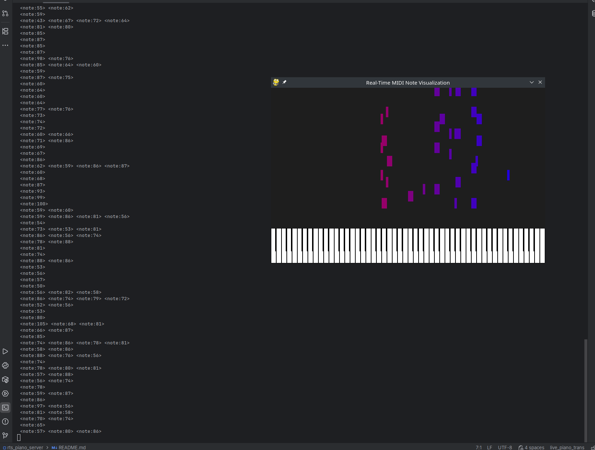
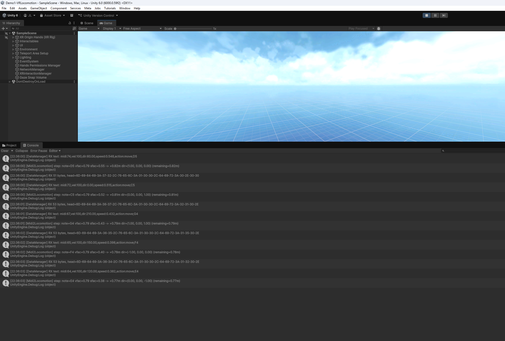

<!--
 * @Author: Your GitHub Username 12345678+yourusername@users.noreply.github.com
 * @Date: 2025-11-09 22:10:45
 * @LastEditors: Your GitHub Username 12345678+yourusername@users.noreply.github.com
 * @LastEditTime: 2025-11-09 23:07:40
 * @FilePath: \Demo1-VRLocomotion\README.md
 * @Description: 这是默认设置,请设置`customMade`, 打开koroFileHeader查看配置 进行设置: https://github.com/OBKoro1/koro1FileHeader/wiki/%E9%85%8D%E7%BD%AE
-->
# 🎹 Demo 1 – Music-Driven Locomotion System

This project implements a **music-driven VR locomotion system**.  
The user can control movement and interaction in a virtual scene through real-time piano performance.  
The system treats musical signals as the core input, achieving synchronized sound-motion behavior and immersive interaction.

---

## ✅ Bonus Objectives Achieved

### 1. AI Integration  
A **real-time Piano-to-MIDI transcription model** is deployed on an external **Ubuntu Studio workstation**.  
The system converts live piano audio into MIDI events and streams them to the Quest 3 via UDP.  
These MIDI events dynamically drive the locomotion logic, forming a **music-controlled movement system**.

### 2. Novel Interaction Devices  
The **piano** itself serves as an external interactive device.  
The performer’s musical gestures directly influence in-scene motion and rhythm, representing a **novel human–computer interaction modality**, fulfilling the “Novel Interaction Devices” objective.

### 3. 2D Content Streaming  
The project implements **real-time audio stream analysis**.  
Due to the Quest 3’s limited compute power and microphone quality, a **semi-hosted architecture** is adopted:  
- The external Ubuntu Studio workstation is equipped with a **Yamaha UR44 audio interface**, **Audio-Technica microphone**, and an **RTX 5090 GPU**.  
- It performs high-fidelity, low-latency audio analysis and sends results to Quest 3 over UDP.  
This component is part of a personal research project and remains closed-source.  
The uploaded Unity project contains the **minimal playable demo** driven by piano notes C–D–E–F–G–A–B.

---

## ⚙️ Unimplemented Features
This build does **not** include vibration or musical feedback.  
As the system is designed for music performance and education, additional vibration or feedback would add little value.  
If needed, haptic effects can be added later by mapping MIDI signals to the controller’s vibration API.

---

## Runtime Snapshot 
  *Real-time piano audio → MIDI transcription pipeline executing on the Ubuntu Studio server that feeds the locomotion system.*

A short demonstration video is included in the same directory:

[▶ Watch Demo Video](./com.DefaultCompany.VRTemplate-20251109-224944-1.mp4)
---

This demo demonstrates a **prototype of immersive interaction driven by live musical signals**.